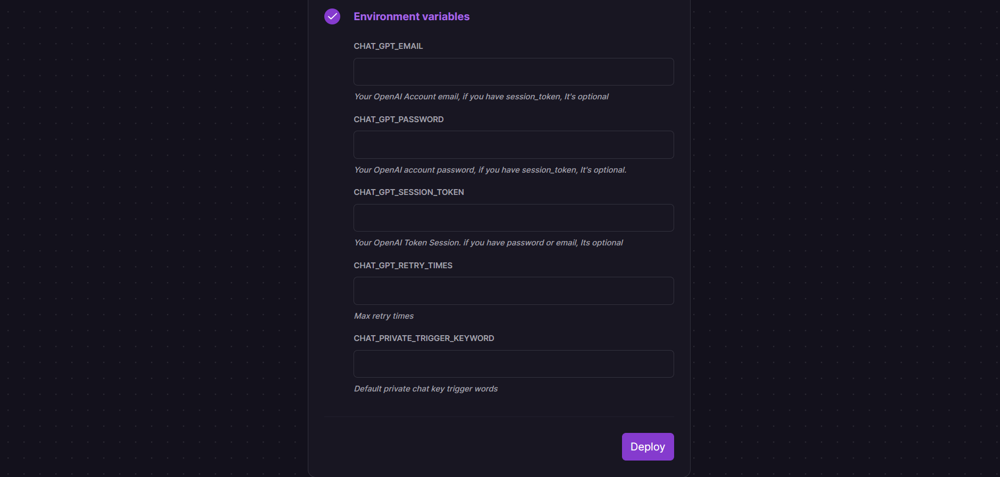
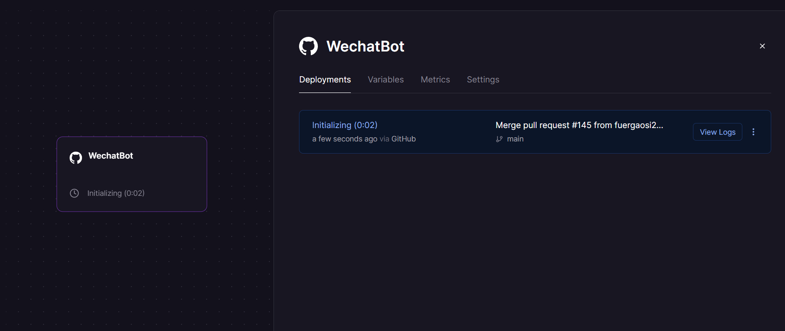
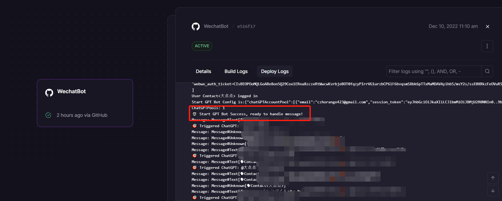

<h1 align="center">Welcome to wechat-chatgpt 👋</h1>
<p>
  
  <a href="#" target="_blank">
    
  </a>
  <a href="https://twitter.com/fuergaosi" target="_blank">
    
  </a>
  </a>
  <a href="https://discord.gg/8fXNrxwUJH" target="blank">
    
  </a>
</p>

> Use ChatGPT On Wechat via wechaty  
English | [中文文档](README_ZH.md)

[](https://railway.app/new/template/BHJD6L?referralCode=FaJtD_)  

If you don't have a server or want to experience rapid deployment, you can use Railway to do so, see [Usage with Railway](#usage-with-railway).

### Update Decomber 27, 2022
Using railway & docker deployment, there may be problems that cannot be solved, we are working on it.

### Update December 20, 2022

Thanks @transitive-bullshit, The ChatGPT API automates the work.  
You should use password & username to login, and config [CAPTCHAs](#CAPTCHAS).  
⚠️ There may be a problem with the Docker image because I don't have an X86 device and Qume doesn't work.

## 🌟 Feature

- [x] Use ChatGPT On Wechat via wechaty
- [x] Support OpenAI Accounts Pool
- [x] Support use proxy to login
- [x] Add conversation Support
- [x] Add Dockerfile
- [x] Publish to Docker.hub
- [x] Add Railway deploy
- [x] Auto Reload OpenAI Accounts Pool
- [X] Add sendmessage retry for 429/503

## Use with docker in Linux(recommended)

```sh
cp config.yaml.example config.yaml
# Change Config.yaml
# run docker command in Linux or WindowsPowerShell
docker run -d --name wechat-chatgpt -v $(pwd)/config.yaml:/app/config.yaml holegots/wechat-chatgpt:latest
# login with qrcode
docker logs -f wechat-chatgpt
```

## Use with docker in Windows

```sh
# Create and modify config.yaml in the current directory
# run docker command in WindowsPowerShell
docker run -d --name wechat-chatgpt -v $(pwd)/config.yaml:/app/config.yaml holegots/wechat-chatgpt:latest
# In the Windows command line (cmd) environment, you may mount the current directory like this:
docker run -d --name wechat-chatgpt -v %cd%/config.yaml:/app/config.yaml holegots/wechat-chatgpt:latest
# login with qrcode
docker logs -f wechat-chatgpt
```

## Upgrade docker image version

```sh
docker pull holegots/wechat-chatgpt:latest
docker stop wechat-chatgpt
docker rm wechat-chatgpt
# run docker command in Linux or WindowsPowerShell
docker run -d --name wechat-chatgpt -v $(pwd)/config.yaml:/app/config.yaml holegots/wechat-chatgpt:latest
# In the Windows command line (cmd) environment, you may mount the current directory like this:
docker run -d --name wechat-chatgpt -v %cd%/config.yaml:/app/config.yaml holegots/wechat-chatgpt:latest
# login with qrcode
docker logs -f wechat-chatgpt
```

## Install

```sh
npm install
```
> NodeJS Version >= 18.0.0

## Config

### Copy config

You need copy config file for setting up your project.

```sh
cp config.yaml.example config.yaml
```

### Get and config Openai account

> If you don't have this OpenAI account and you live in China, you can get it [here](https://mirror.xyz/boxchen.eth/9O9CSqyKDj4BKUIil7NC1Sa1LJM-3hsPqaeW_QjfFBc).

#### Use account and password

You need get OpenAI account and password.
Your config.yaml should be like this:

```yaml
chatGPTAccountPool:
  - email: <your email>
    password: <your password>
# if you hope only some keywords can trigger chatgpt on private chat, you can set it like this:
chatPrivateTiggerKeyword: ""
```

⚠️ Trigger keywords must appear in the first position of the received message.
⚠️ Pls make sure your network can log in to OpenAI, and if you fail to login in try setting up a proxy or using SessionToken.

**Setup proxy:**

You can configure in `config.yaml`:

```yaml
openAIProxy: <Your Proxy>
```

### CAPTCHAS

> The browser portions of this package use Puppeteer to automate as much as possible, including solving all CAPTCHAs. 🔥

> Basic Cloudflare CAPTCHAs are handled by default, but if you want to automate the email + password Recaptchas, you'll need to sign up for one of these paid providers:

> - [nopecha](https://nopecha.com/) - Uses AI to solve CAPTCHAS
>   - Faster and cheaper
>   - Set the `NOPECHA_KEY` env var to your nopecha API key
>   - [Demo video](https://user-images.githubusercontent.com/552829/208235991-de4890f2-e7ba-4b42-bf55-4fcd792d4b19.mp4) of nopecha solving the login Recaptcha (41 seconds)
> - [2captcha](https://2captcha.com) - Uses real people to solve CAPTCHAS
>   - More well-known solution that's been around longer
>   - Set the `CAPTCHA_TOKEN` env var to your 2captcha API token

So you should config `NOPECHA_KEY` or `CAPTCHA_TOKEN` in your Environment Variables.

## Start Project

```sh
npm run dev
```
## Usage with Railway

[Railway](https://railway.app/) is a deployment platform where you can provision infrastructure, develop with that infrastructure locally, and then deploy to the cloud.This section describes how to quickly deploy a wechat-chatgpt project using Railway.

Firstly, you'll need to sign up for a Railway account and sign in using GitHub verification.

Then click the one-click deployment button below to deploy.

[](https://railway.app/new/template/BHJD6L?referralCode=FaJtD_)

After some validation is complete, you can begin the deployment.You will see the following interface:



Some environment variables need to be configured:

- **CHAT_GPT_EMAIL** : Your OpenAI Account email.

- **CHAT_GPT_PASSWORD** : Your OpenAI Account password.

- **CHAT_GPT_RETRY_TIMES** : The number of times to retry when the OpenAI API returns 429 or 503.

- **CHAT_PRIVATE_TRIGGER_KEYWORD** : If you hope only some keywords can trigger chatgpt on private chat, you can set it.

- **CHAT_TRIGGER_RULE** ：If you hope only pass by a regular expression check can trigger chatgpt, you can set it

Click the Deploy button and your service will start deploying shortly.The following interface appears to indicate that the deployment has begun:



When the deployment is displayed successfully, click to view the logs and find the WeChat login link in Deploy Logs.


Click to enter and use your prepared WeChat to scan the code to log in.

Log in successfully and start sending and receiving messages(This process can take several minutes):



Besides, in deployment, you may encounter the following issues:

- **Error: ⚠️ No chatgpt item in pool** : This error means that you have not configured the OpenAI account information correctly. You can solve this problem from the following aspects:1. Check whether the token or openAI account and password are filled in correctly. 2. Redeploy Current Services.Note that the above should be modified on the Variables page in Railway Dashboard. 3. Please make sure that CloudFlare human authentication is present, if it is, Headless browser may not be able to simulate logging into OpenAI.
- **After the deployment is complete, the QR code is not generated**.Try **refreshing** the page to see again if the Deploy Logs panel generated a link and QR code.
- **The generated QR code cannot be scanned**.On the generated QR code, there is a link that can be clicked to scan the QR code.
- **Message feedback is very slow**.Because Railway's servers are deployed overseas, there is an increase in message feedback latency, but it is still within the acceptance range. If you are time sensitive, you can use your own server deployment.

If you are logging in for the first time, then you need to scan the qrcode.

## ✨ Contributor

<a href="https://github.com/fuergaosi233/wechat-chatgpt/graphs/contributors">
  
</a>


## 🤝 Contributing

Contributions, issues and feature requests are welcome!<br />Feel free to check [issues page](https://github.com/fuergaosi233/wechat-chatgpt/issues).

## Show your support

Give a ⭐️ if this project helped you!
